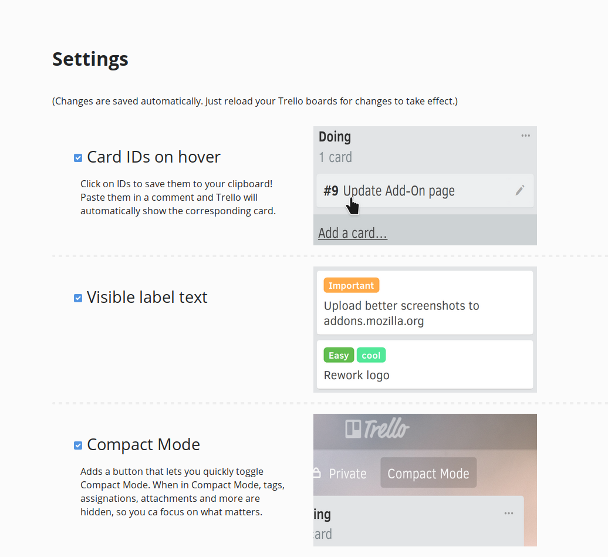

# Trello Super Powers

Firefox add-on to enhance your Trello (trello.com) experience. Get it here ->  https://addons.mozilla.org/en-US/firefox/addon/trello-super-powers/

Trello Super Powers implements some small yet useful enhancements into your everyday Trello usage.

- Visible label text
- Clickable IDs on hover (+ they get copied to your clipboard when clicked)
- Compact Mode: Removes all clutter if you want to focus
- Resizable lists: imply click and drag to adjust the size of your Trello lists
- See at a glance how many cards are in each list

Also you can find explanation of these features and a way to turn them off in the settings of the add-on ('about:addons' in your address bar or 'Add-Ons' in the hamburger menu):

There are plenty of features waiting to be implemented, most notably Account integration, which would allow for blazing fast access to your boards and notification integration which would give you the newest from the newest directly from the Firefox toolbar.
